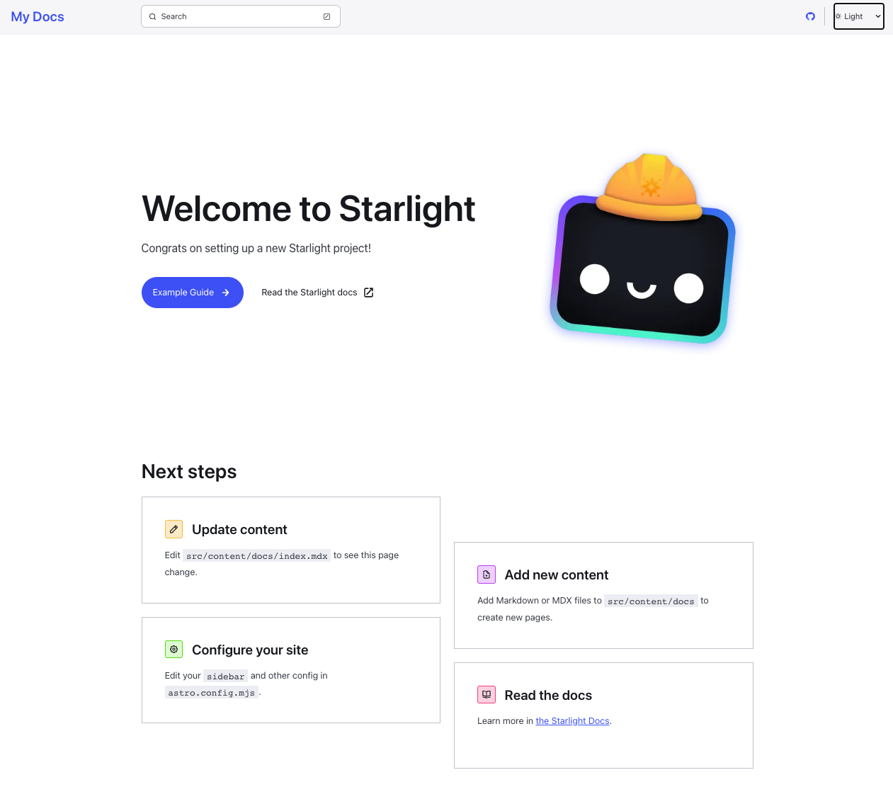
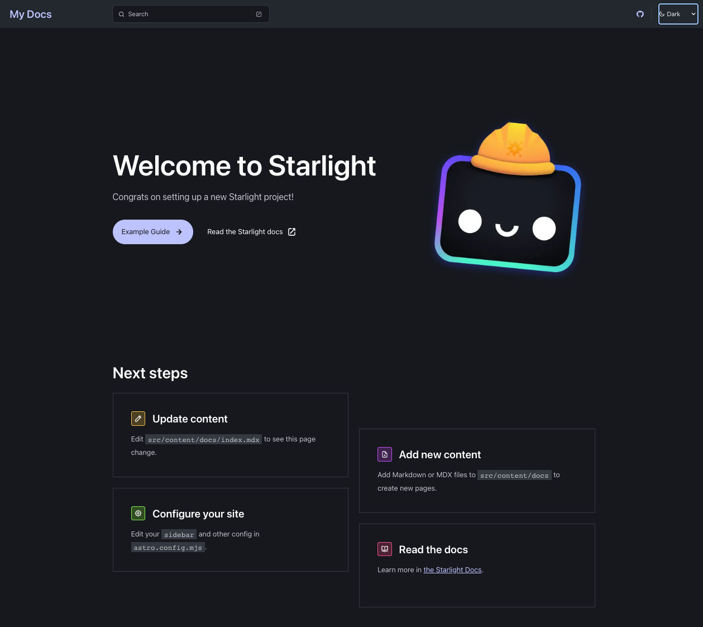
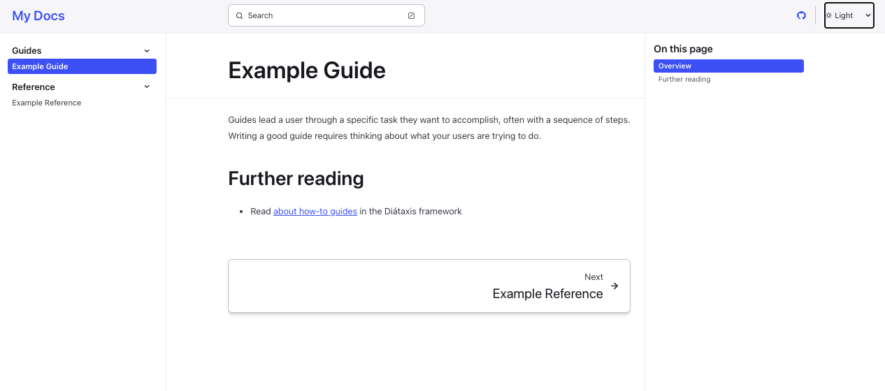
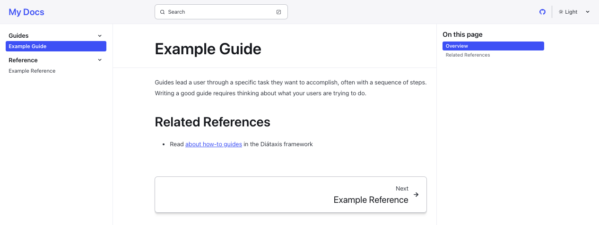
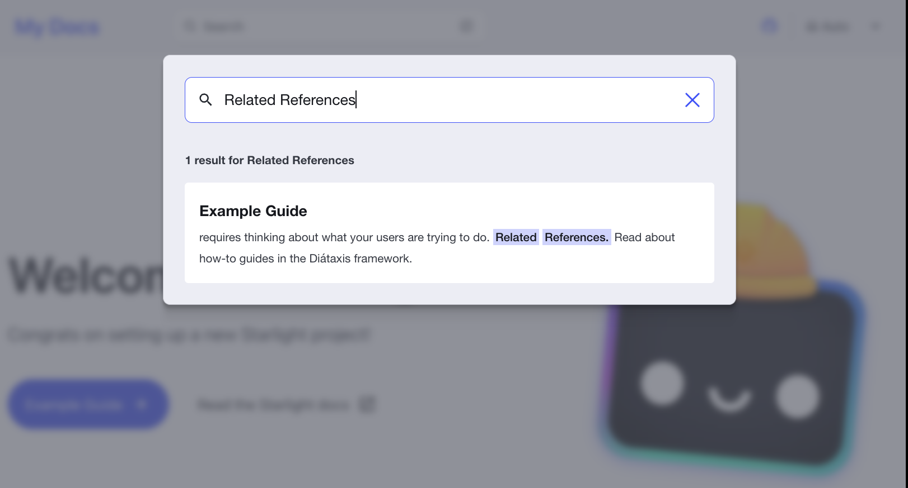

# Astro Starlight On GitHub Pages

> Objectives

Build and deploy an Astro Starlight Documentation site to GitHub Pages.
Explore features and customization - validate its use as reusable template.

---

## 1. Why Astro?

Astro is a free, open-source option for static site generation that bills itself as _the all-in-one web framework designed for speed_. Three features that make it interesting:
 - Islands architecture - with **zero client-side JS**
 - Plays well with others - **bring your own components**
 - Rich ecosystem - **content focused & community-driven**

This gives you the benefits of performance & flexibility, with rich themes and integrations for quickstart adoption. It's a rising star for JS frameworks and used by industry teams - stability ftw.

---

## 2. Why Starlight?

Astro has a [large collection of themes](https://astro.build/themes) supporting different site categories and frontend technology components. The ["Official" filter](https://astro.build/themes?search=&categories%5B%5D=official) identifies themes created by the Astro team. [Starlight](https://astro.build/themes/details/starlight/) is the default **documentation focused** framework from Astro, currently in very early release. It promises:
 - fast, accessible, easy-to-use websites
 - site-navigation, search, i18n, SEO support
 - code highlighting, dark mode, easy-to-read typography
 - write in Markdown, MDX or Markdoc

Plus all Astro benefits (e.g., bring your own UI components).

 - [See the GitHub Repo](https://github.com/withastro/starlight)
 - [Read the Docs](https://starlight.astro.build/)
 - [Get Started](https://starlight.astro.build/getting-started/)

---
## 3. Quickstart 

1. Verify you have Node.js installed. I use `nvm` and default to the LTS version for Node.js.

    ```bash
    $ nvm use --lts
    Now using node v18.16.0 (npm v9.6.7)
    ```

2. Scaffold out a Starlight project with Astro.

    ```bash
    $ npm create astro@latest -- --template starlight
    ```

    As part of setup, you define the destination folder (`website`), install dependencies and configure Typescript, git usage.

3. Preview the default Starlight site.

    ```bash
    $ cd website
    $ npm run dev
    ```

    This runs a dev server on `http://localhost:3001` which watches `src/content` for changes (hot reload).

4. Open the browser to that URL and let's see what we got:

      > A Landing Page (Light Mode)

    

      > A Landing Page (Dark Mode)

    

      > A Documentation Page (Default)

    

      > The Documentation Page Updated (Hot Reload)

    

      > The Search Feature (oh-oh!)

    

4. Alright, let's try to build the **production** version of the site locally.

    ```bash
    $ cd website
    $ npm run build
    ...
    ...
    Finished in 0.13 seconds
    08:53:44 PM [build] 4 page(s) built in 4.61s
    08:53:44 PM [build] Complete!
    ```
5. You'll notice this builds the production version in the `dist` folder. Let's preview it.

    ```bash
    $ npm run preview
    ```
    The output indicates the production server is running at `http://localhost:3000` - let's open that up. You see the same pages as before - but now let's try search. _In fact, let's search for the changed text from above to see if it can be found_.

    > Search for "Related References" in Production

    OMG - it works!! We didn't have to do anything extra to activate search indexes. Basic keyword search out of the box!

    

---

4. Deployment

Before we explore deploying the production build to GitHub Pages, let's commit the current version. **Done!**

Now, let's [deploy the Astro Site to GitHub Pages](https://docs.astro.build/en/guides/deploy/github/). Astro provides an official `withastro/action` that should make this easy.

 1. Set `site` and `base` options in `astro.config.js`
 2. Create `.github/workflows/deploy.yml` and copy [the provided workflow](https://docs.astro.build/en/guides/deploy/github/).
 3. Since we have our site source in the `website/` subfolder (vs. root of repo), uncomment the `with` section of the install steps in workflow and set the `path` to `./website`
 4. Go to the GitHub repo's [Settings > Pages](https://github.com/30DaysOf/astro-starlight-ghpages/settings/pages) configuration. Choose `GitHub Actions` as the Source of your site. 
 
**Commit the changes in your code to GitHub**. You should see the deploy action run. If successful, the GitHub Pages endpoint should show the deployed site.  It's LIVE! [https://30daysof.github.io/astro-starlight-ghpages/](https://30daysof.github.io/astro-starlight-ghpages/)!!


> Issue: Hero links not resolving base path correctly

The "Example Guide" button on the landing page is mapped to "/guides/example/" but when clicked, does not take base prefix (repo path) into account, resulting in a 404. The same route used from the sidebar works just fine. **I am assuming this has to do with the difference in how links are resolved in frontmatter vs. markdown** _Issue raised in community chat. Waiting for response_.

